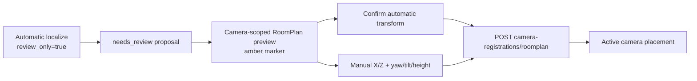

# Homes, rooms & calibration

All operations in this page require a bearer session and a membership in `{home_id}`. Publisher memberships are blocked from home-control endpoints. IDs are opaque strings from the API; examples use `home_demo` only as a placeholder.

For the reasoning behind `camera-cv-2d` versus `roomplan-lidar-3d`, current-map
selection, RoomPlan camera registration, visual landmarks, and the client 2D/3D
rendering gate, read [Spatial models, maps & detection](/api/spatial-vision).
This page is the exact route reference for those concepts.

## Identity and runtime

### `GET /api/v1/me`

Operation ID: `me_api_v1_me_get`. Returns the authenticated actor, their care
space and resident display name, the latest enabled camera (if present), and
whether runtime processing is paused. The home object also returns
`careSetting` (`home` or `residence`) and `supportFocus` (`general` or `mci`),
which clients use to keep live setup language and care context consistent.

### `GET /api/v1/account/homes`

Returns every non-publisher care-space membership for the authenticated account.
Each item contains the care-space ID and name, resident display name,
`careSetting`, `supportFocus`, membership role, and an `active` flag for the
home bound to the current bearer session. Publisher camera sessions cannot use
this account-management route.

### `POST /api/v1/account/homes`

Creates another care space for the authenticated person. The body accepts
`name`, `care_setting` (`home` or `residence`), and `support_focus` (`general`
or `mci`). The existing user becomes an `admin` member of the new care space,
and the response is a new bearer session scoped to it. The original session is
not implicitly revoked.

### `POST /api/v1/account/homes/{home_id}/activate`

Switches the account's active care space by verifying that the authenticated
user has a non-publisher membership in `{home_id}` and then issuing a new
bearer session scoped to that home. A missing membership returns `404`; knowing
a home ID does not grant access. Clients must replace their active token and
home ID together before making home-scoped requests.

### `GET /api/v1/homes/{home_id}/runtime`

Operation ID: `runtime_api_v1_homes__home_id__runtime_get`. Returns `{ home_id, paused, video_capture_consented }`. A revoked `video_capture` consent pauses the runtime flag; it does not imply that historical rows are erased.

## People receiving care

Care recipients are home-scoped care profiles, not login identities. Adding a
person here does not create a `user`, a `membership`, an invitation, or a
session. This keeps a residence with many residents, or a household with two
people receiving care, separate from the caregivers/admins who can access the
care space.

### `GET /api/v1/homes/{home_id}/care-recipients`

Returns `{ data: [...] }` for the active care space. Each row contains `id`,
`display_name`, optional `relationship`, optional `room_label`, and
`medication_reminders_enabled` plus `created_at`. The reminder flag is derived
from the latest recipient-scoped `medication_management` consent.

### `POST /api/v1/homes/{home_id}/care-recipients`

Creates a care profile with required `display_name` (1–120 trimmed characters)
and optional `relationship` / `room_label` fields (up to 120 characters each).
The response wraps the created record in `{ data: ... }`.

### `PATCH /api/v1/homes/{home_id}/care-recipients/{recipient_id}`

Updates the supplied care-profile fields and returns `{ data: ... }`. Empty
optional strings are normalized to `null`; `display_name` cannot be blank.

### `DELETE /api/v1/homes/{home_id}/care-recipients/{recipient_id}`

Deletes the care profile and returns the deleted record in `{ data: ... }`.
This operation does not revoke any account or caregiver access because care
recipients and memberships are independent entities.

These routes use the same authenticated home boundary as other home controls
and reject publisher-device sessions. Medication and consent APIs now expose an
explicit `care_recipient_id` scope for these profiles. That field is distinct
from the legacy `subject_user_id` membership scope; the server never silently
converts one identity type into the other.

## Cameras

### `GET /api/v1/homes/{home_id}/cameras`

Operation ID: `cameras_api_v1_homes__home_id__cameras_get`. Returns `{ data:
[...] }` with enabled camera read models, newest first. Each read model includes
the publisher-backed device name plus `online` / `paused` status from the
current runtime state. When a native RoomPlan map is current, the row also
contains `calibration_needed`, `roomplan_registration_status`, and
`roomplan_map_id`. `calibration_needed=false` is reported only for a valid
active registration against that exact RoomPlan revision; an old-map or
pending-review pose does not clear the badge.

### `POST /api/v1/homes/{home_id}/cameras`

Operation ID: `camera_api_v1_homes__home_id__cameras_post`. Request (`CameraIn`) requires `name` (1–120 chars) and accepts nullable `room_id`. Creates an enabled camera and returns its ID, fields, and `enabled: true`.

### `DELETE /api/v1/homes/{home_id}/cameras/{camera_id}`

Operation ID: `camera_delete_api_v1_homes__home_id__cameras__camera_id__delete`.
Admin/caregiver operation that disables the camera, invalidates its active
calibration, revokes its publisher session, and clears unused pairing codes.
The camera row remains as an audit-safe tombstone for historical map and
observation references.

## Rooms

### `GET /api/v1/homes/{home_id}/rooms`

Operation ID: `rooms_api_v1_homes__home_id__rooms_get`. Returns `{ data: [...] }` ordered by creation time.

### `POST /api/v1/homes/{home_id}/rooms`

Operation ID: `room_api_v1_homes__home_id__rooms_post`. Request (`RoomIn`) requires `name` (1–120 chars). Returns the created room ID and name.

## Maps and scene

The target map read model carries explicit source and dimension metadata. The
dashboard uses this gate once those fields are available:

| Source | Dimension | Meaning |
| --- | --- | --- |
| camera-cv-2d | 2D | Relative polygons and walls generated from the paired camera sweep |
| roomplan-lidar-3d | 3D | Native RoomPlan geometry from a LiDAR-capable iPhone or iPad |
| legacy-2d | 2D | Older provisional/manual data that needs a fresh camera sweep |

### `GET /api/v1/homes/{home_id}/maps`

Operation ID: `maps_api_v1_homes__home_id__maps_get`. Returns the stored map
read models, newest revision first. The current response includes the map
record, map data, coordinate frame, source, approximate flag,
localization status, metadata, optional reference scale, detected furniture,
door/window openings, and revision.

### `GET /api/v1/homes/{home_id}/maps/current`

Operation ID: `current_map_api_v1_homes__home_id__maps_current_get`. Returns
the newest eligible map read model or `404 No room map has been uploaded`.
Camera-derived revisions are eligible only when they carry real geometry-model
provenance; historical fixture revisions remain listable for audit but cannot
drive the current map or scene.

### `GET /api/v1/homes/{home_id}/maps/{map_id}`

Operation ID: `map_detail_api_v1_homes__home_id__maps__map_id__get`. Returns one
map read model or `404 Map not found`.

### `GET /api/v1/homes/{home_id}/scene`

Operation ID: `scene_api_v1_homes__home_id__scene_get`. The current response
contains `sceneId`, `version`, `source`, `dimension`, `geometryStatus`,
`rescanRequired`, `zones`, `polygons`, `walls`, detected `furniture`,
door/window `openings`, `camera`, `confidence`, optional `scale`, `modelVersion`,
`mapId`, and `coordinateFrame`. An empty home returns a null scene with version
zero and `rescanRequired: true`.

### `POST /api/v1/homes/{home_id}/maps/provisional`

Operation ID: `provisional_map_api_v1_homes__home_id__maps_provisional_post`.

The compatibility route accepts `camera_id`, optional `room_id`, source
resolution, and caller-supplied zones. It stores `legacy-2d` data with
`approximate=true` and `localization_status=rescan-required`. It does not call
the room-layout service and never invents missing bounds.

### Automatic camera map generation

The paired publisher starts a bounded generation job after recording its own
`video_capture` consent:

```text
POST /api/v1/homes/{home_id}/cameras/{camera_id}/map-generation
GET  /api/v1/homes/{home_id}/cameras/{camera_id}/map-generation
POST /api/v1/homes/{home_id}/cameras/{camera_id}/map-generation/{job_id}/frames
GET  /api/v1/homes/{home_id}/cameras/{camera_id}/map-generation/{job_id}
```

The start body requires `resolution_width` and `resolution_height`, and accepts
`room_id`, `room_label`, and `orientation`. The frame body contains 3–20
`frame_base64`, `width`, `height`, and optional `captured_at` entries. A frame
is limited to 3 MB after decoding and a batch to 18 MB. The publisher can only
submit frames for its own camera; caregivers/admins can read status. The job
states are `collecting`, `processing`, `ready`, `needs_rescan`, `unavailable`,
and `failed`. Only `ready` creates a new map revision.

### `POST /api/v1/homes/{home_id}/maps/{map_id}/scale`

The caregiver can persist a reference scale for a real camera-derived map by
submitting two normalized map points, a measured `length_m`, and a label. The
response stores `method: "caregiver_reference"` and the conversion used by the
map ruler. This does not turn RGB geometry into RoomPlan/LiDAR metric data; the
map remains an approximate 2D camera map.

### `POST /api/v1/homes/{home_id}/maps/roomplan`

Operation ID: `roomplan_map_api_v1_homes__home_id__maps_roomplan_post`.

The handler accepts `normalized_scan` plus required `scan_metadata` fields:
`provenance=native-roomplan`, `device_model`, `lidar=true`,
`roomplan_version`, metric `units`, `up_axis=Y`, and `geometry_type=3d`. The
scan itself must contain actual 3D vectors/vertices and the same metric/up-axis
declarations. Missing provenance, missing LiDAR evidence, malformed geometry,
or a browser payload returns `422`. A browser client must never call this route
to turn an RGB map into 3D.

The native client sends the reachable authenticated API base URL configured for
the deployment (for example, the Tailscale HTTPS URL on a phone); it must not
use the phone's own `localhost` address.

### `PUT /api/v1/homes/{home_id}/maps/{map_id}/usdz`

Attaches the optional exported RoomPlan USDZ to a validated native 3D map. The
request body is binary with content type `model/vnd.usdz+zip` (the backend also
accepts compatible ZIP content types). The upload is idempotent for the map
attachment key, requires the same home authorization as the map, is limited to
50 MiB, rejects unsafe ZIP entries and packages without a USD asset, and stores
the SHA-256 digest in map metadata. The response includes `available`, byte
count, digest, content type, and the authenticated download path.

### `GET /api/v1/homes/{home_id}/maps/{map_id}/usdz`

Downloads the persisted native attachment with private cache headers, an
`ETag` based on the SHA-256 digest, and an inline `.usdz` filename. Missing or
failed attachments return `404`; they do not change the canonical structured
RoomPlan scene or enable a fabricated fallback model. Export includes the
attachment metadata, and a completed privacy deletion removes both the
structured map artifacts and the USDZ object.

### `POST /api/v1/homes/{home_id}/maps`

The generic map upload accepts `map_data`, optional `room_id`, and a coordinate
frame, then stores source `legacy-2d` with `rescan-required`. It is a
compatibility boundary for existing clients; it cannot unlock the 3D view.

## Fixed-camera RoomPlan placement review

The camera setup UI treats automatic localization as a proposal. It never
silently replaces a confirmed transform.

### `GET /api/v1/homes/{home_id}/cameras/{camera_id}/roomplan-readiness`

Returns the active RoomPlan map ID/source/dimension plus whether the private
visual landmark artifact is ready. A publisher may inspect only its own camera.
This is the lightweight polling route used before attempting automatic 3D
placement.

### `POST /api/v1/homes/{home_id}/cameras/{camera_id}/localize-roomplan`

Accepts the fixed-camera frames plus FOV/intrinsics and optional `review_only`.
Camera setup sends `review_only=true`. A strong solve returns
`status=positioned`, `camera_to_world`, confidence and PnP diagnostics, but is
stored as `needs_review` and returns `review_required=true`; it does not
invalidate the current active registration. A weak or scene-invalid pose
returns `needs_rescan` with no usable transform.

### `POST /api/v1/homes/{home_id}/cameras/{camera_id}/roomplan-calibration-session`

Starts a caregiver-controlled four-point RoomPlan calibration session for one
fixed camera. The active map must be native `roomplan-lidar-3d`, its visual
landmark artifact must be ready, and video capture consent must be active. The
response contains four metric floor targets, current progress, a ten-minute
expiry, and `raw_frames_persisted=false`. Session state is process-local and is
not durable across API restarts.

### `GET /api/v1/homes/{home_id}/cameras/{camera_id}/roomplan-calibration-session`

Returns the active session's target/progress/proposal metadata. Caregivers may
read same-home sessions; a publisher may read only its own camera session. Raw
JPEGs and the transient frame-anchor bundle are never returned.

### `POST /api/v1/homes/{home_id}/cameras/{camera_id}/roomplan-calibration-session/request-capture`

Caregiver command that marks the current target `capture_requested`. The body
contains `target_index`. The index must match the server's current target, so a
stale iPhone screen cannot accidentally label a fixed-camera frame with the
wrong RoomPlan XYZ point.

### `POST /api/v1/homes/{home_id}/cameras/{camera_id}/roomplan-calibration-session/frames`

Publisher-only endpoint for the paired fixed camera. It accepts one or two
bounded frames for the currently requested target. After targets 1–3 the API
advances to the next standing point. Target 4 triggers the existing
`localize-roomplan` path with `review_only=true` and four known person anchors.
Frame bytes remain in memory only during this collection and are cleared before
the review response. A strong solve returns `status=review` plus a proposal; it
still does not activate the camera.

### `DELETE /api/v1/homes/{home_id}/cameras/{camera_id}/roomplan-calibration-session`

Cancels the session and drops all transient frame/anchor state immediately. A
new RoomPlan revision or session expiry likewise invalidates the session rather
than applying stale coordinates.

### `GET /api/v1/homes/{home_id}/cameras/{camera_id}/roomplan-placement-preview`

Returns the active native RoomPlan scene used by the placement-review UI. This
route deliberately exists separately from the general `/scene` endpoint so a
paired publisher can review only its own camera placement without gaining
household dashboard permissions. Another publisher camera receives `403`; a
missing active native RoomPlan map returns `409`. Admin/caregiver sessions may
also read it.

### `GET /api/v1/homes/{home_id}/cameras/{camera_id}/roomplan-placement-preview/usdz`

Returns the active RoomPlan USDZ through the same camera-scoped authorization
boundary. The publisher-facing top-down preview uses this asset while the
normal map USDZ route remains a household dashboard surface.

### `POST /api/v1/homes/{home_id}/camera-registrations/roomplan`

Explicitly activates a reviewed automatic proposal or a manually constructed
4×4 `camera_to_world` transform for the active native RoomPlan revision. A
publisher can register only its own camera. The successful save invalidates the
prior active and pending-review rows for that camera; until this endpoint
succeeds, the old active placement remains unchanged.



## Camera pose, not fake calibration

The required automatic camera result stores a relative camera pose, image-space
transform, homography or reprojection error where available, and confidence. It
does not report an invented accuracy in meters: RGB-only mapping has no
reliable metric scale.

The existing `POST /api/v1/homes/{home_id}/calibrations` endpoint accepts
intrinsics and extrinsics for compatibility with older clients. Camera-derived
jobs store model metrics and `accuracy_m=null`; RGB calibration does not claim
meter accuracy. Legacy manual records, three-anchor UI, hardcoded meter values,
and provisional maps are rescan-required and are not the source of a current
camera-derived map.
