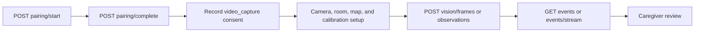

# API overview

The FastAPI application publishes generated OpenAPI at `/api/v1/openapi.json` and commits the same contract to `one/contracts/openapi.json`. The contract currently describes 42 paths, 48 operations, and 23 Pydantic input/error schemas. Regenerate it with `python scripts/generate_openapi.py`; frontend types are generated from that artifact. All product routes are versioned under `/api/v1`; health and pairing start have their own bootstrap policy, while member data is bearer-protected.

This section is an implementation reference, not a product promise. Route names, operation IDs, request constraints, and response status codes below were checked against the committed contract and the current FastAPI handlers. The contract is authoritative when a client and a prose page disagree.

## Endpoint inventory

| Area | Routes | Auth / gate |
| --- | --- | --- |
| Health | `GET /api/v1/health` | Public |
| Pairing/session | `POST /api/v1/pairing/start`, `POST /api/v1/pairing/complete`, `DELETE /api/v1/sessions/current`, `POST /api/v1/homes/{home_id}/pairing/start` | Bootstrap / one-time code / bearer |
| Identity/home | `GET /api/v1/me`, `GET /api/v1/homes/{home_id}/runtime` | Bearer + home membership |
| Setup | Cameras, rooms, maps, scene, calibrations | Bearer + home membership; publisher blocked for controls |
| Objects/vision | Objects, last-seen, observations, `POST /api/v1/homes/{home_id}/vision/frames` | Bearer; vision also needs active `video_capture` consent |
| Events/SSE | `GET /api/v1/homes/{home_id}/events`, `GET /api/v1/homes/{home_id}/events/stream` | Bearer + home membership |
| Clips | Create/list records, upload bytes, retrieve content | Bearer + home membership; expiry and publisher gates |
| LiveKit | Token minting and webhook | Bearer for token; signed webhook in production |
| Family | Members, invitations, invitation acceptance, family assistant | Bearer + `family_mode` consent; role/subject gates |
| Medication | Plans, updates, check-ins, deterministic reminders | Bearer + `medication_management` consent |
| Check-ins | Resident check-in and caregiver summary | Bearer + role/subject policy; bounded context |
| Privacy | Export and delete | Bearer + home membership; deletion is admin-only |
| Admin | Retention run | Bearer + admin role |

Responses are JSON unless an event stream or clip body is requested. The exact Pydantic constraints and status codes in `one/app/main.py` are authoritative; regenerate or inspect OpenAPI when adding a client.

## Reading the endpoint pages

Every operation is listed exactly once in the pages below, using its `/api/v1` path and generated operation ID. `Bearer` means `Authorization: Bearer <session token>`. “Publisher blocked” refers to paired camera publisher memberships: they may publish video when consent permits it, but cannot use home controls, family records, or privacy controls. Query parameters shown as optional in OpenAPI are omitted by default by the server.

## Common request sequence

The common setup and review sequence is shown below. Each protected step remains scoped to the paired home and its active consent policy.

Pairing completion creates the bearer session; the API rejects vision and media operations when the required consent is missing or paused.

Home IDs are authorization-scoped. A valid token for one home must not be treated as a global account token.

## Generated contract workflow

The backend CI runs tests, regenerates `contracts/openapi.json`, and fails if the working tree changes. Frontend CI runs `npm run generate:api` against the sibling contract when available or its pinned `contracts/openapi.json` snapshot in a standalone checkout, then fails if `src/api/schema.d.ts` changes. Update route models, both client snapshots, and generated clients together.
