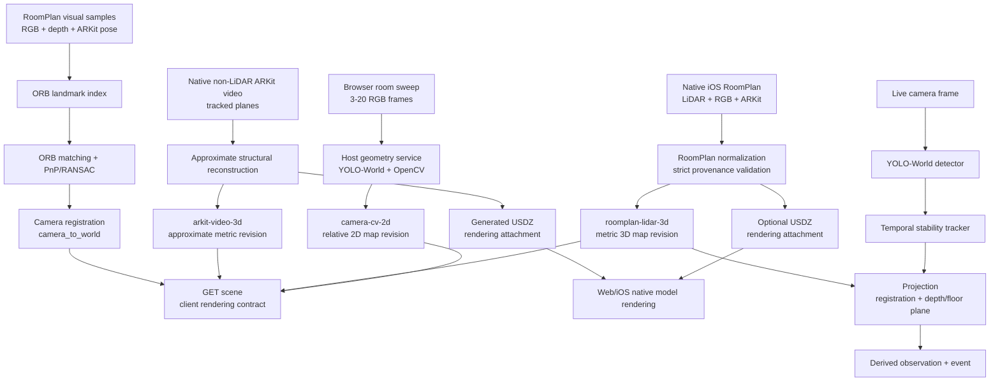
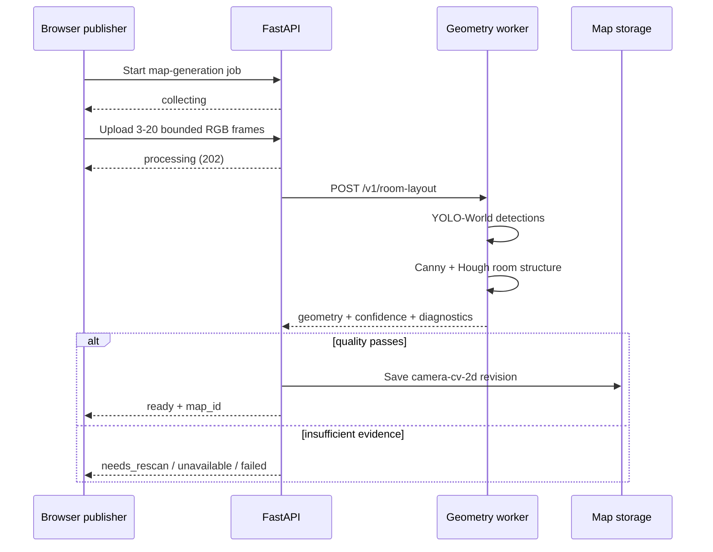
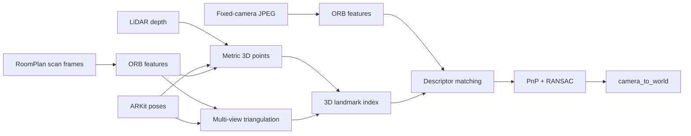

# Spatial models, maps & detection

This page explains how ONE turns camera and LiDAR input into maps, camera
positions, object detections, and reviewable observations. It is the conceptual
companion to the endpoint reference: start here when changing the mapping or
vision stack, then use [Homes, rooms & calibration](/api/homes) and
[Objects, vision & events](/api/observations) for the exact HTTP contract.

The most important rule is that ONE has **four different spatial pipelines**.
They share storage and scene APIs, but they are not interchangeable:

| Pipeline | Input | Main processing | Output | Coordinate truth |
| --- | --- | --- | --- | --- |
| Browser camera room sweep | 3–20 temporary RGB frames | Local YOLO-World + OpenCV structure estimation | `camera-cv-2d` map | Relative/image-space 2D |
| Native RoomPlan scan | LiDAR + RGB + ARKit through iOS RoomPlan | Apple RoomPlan + ONE normalization/validation | `roomplan-lidar-3d` map | Metric `roomplan-local` 3D |
| Native ARKit video scan | ARKit tracking + detected planes on a non-LiDAR iPhone | ONE structural reconstruction + USDZ generation | `arkit-video-3d` map | Approximate metric `arkit-world` 3D |
| Live object detection | Individual camera frames | Local YOLO-World + temporal tracker + optional RoomPlan projection | detections, observations, events | Zone fallback or registered RoomPlan 3D |

A successful detection does not create a room map. A successful 2D sweep does
not create a 3D model. A measured reference on a 2D map does not turn it into
RoomPlan geometry.

## The mental model

There are four related data types that are easy to confuse when working on the
API:

1. A **map revision** is persisted spatial evidence. It records provenance,
   dimension, coordinate frame, geometry, model metadata, and revision history.
2. The **scene** is the compact read model the clients use to decide what they
   are allowed to render. It is derived from the current map revision.
3. A **camera registration** places a physical camera inside an existing native
   RoomPlan coordinate frame. It is separate from the map itself.
4. An **observation** is a time-specific detected object position. It can point
   at a map revision, but it does not modify the map geometry.



## Which model does what?

The word “model” means several different things in this stack. These are the
actual responsibilities:

| Component | Runs where | Responsibility | What it must not claim |
| --- | --- | --- | --- |
| YOLOv8-World v2 | Host-side geometry service through PyTorch/MPS | Detect furniture, doors/windows, structural labels, and live household-object candidates | Metric room geometry from RGB alone |
| OpenCV Canny + Hough line processing | Host-side geometry service | Estimate visible room boundaries from a browser sweep | LiDAR precision or survey-grade walls |
| Apple RoomPlan + ARKit | Native iOS on supported LiDAR hardware | Capture metric walls, floors, openings, objects, transforms, dimensions, and camera poses | A browser-generated or simulated 3D room |
| ARKit guided video capture | Native iOS on non-LiDAR hardware | Capture tracked metric planes/surfaces for an approximate room reconstruction | RoomPlan provenance, LiDAR precision, or fixed-camera registration |
| OpenCV ORB + triangulation/depth | Host-side geometry service | Build visual landmarks tied to RoomPlan coordinates | Persistent raw scan imagery |
| OpenCV `solvePnPRansac` | Host-side geometry service | Recover a fixed camera pose from 2D image features ↔ 3D RoomPlan landmarks | A pose when match quality is weak |
| LM Studio / Qwen | Backend integration, downstream of collected context | Check-in/caregiver summaries | Mapping, detection, authorization, or spatial truth |

The geometry worker is intentionally outside Docker so Apple MPS can be used by
PyTorch. The API calls it through `ONE_GEOMETRY_SERVICE_URL` (normally
`http://host.docker.internal:8090`). The worker is an internal processing
dependency; clients never call it directly.

## 1. Browser camera → approximate 2D map

The browser camera mapping path is a bounded room walkthrough. Pairing and live
camera publishing work without a map; mapping is optional room context.



### What happens inside the worker

The worker runs YOLO-World across the submitted frames. Bounding boxes are
normalized into `0..1` image coordinates. Detections are grouped into three
useful sets:

- furniture such as beds, sofas, chairs, tables, desks, cabinets, shelves,
  wardrobes, televisions, toilets, refrigerators, ovens, sinks, and lamps;
- openings (`door`, `window`);
- structural labels (`wall`, `floor`, `ceiling`) used as supporting evidence.

Repeated detections of the same furniture/opening label are clustered by
image-space proximity so the map does not blindly create one object per frame.
The cluster keeps confidence-weighted centre and size values.

For the room boundary, OpenCV converts the same temporary RGB frames to
grayscale, runs Canny edges, then probabilistic Hough line detection. Stable
horizontal and vertical line groups estimate the visible top/bottom/left/right
room bounds. If line evidence is weak but the real detector found structural
boxes, their extent can provide the secondary structural estimate. If neither
path provides enough evidence, the result is `needs_rescan`.

The resulting `camera-room-2d.v1` payload contains:

- room polygons and walls;
- clustered furniture;
- door/window opening segments;
- a relative camera pose;
- image-space/inference metadata;
- confidence, reprojection residual, inlier ratio, model version, and
  diagnostics.

The backend applies its own quality gate before persistence. Defaults are
confidence ≥ `0.65`, reprojection error ≤ `20 px`, and structural inlier ratio
≥ `0.65`; deployments can override those settings. Failure keeps the previous
map intact.

### Why this map is always 2D

RGB frames do not provide trustworthy metric scale by themselves. The saved map
therefore has:

```text
source = camera-cv-2d
dimension = 2d
approximate = true
metric_scale_known = false
```

The caregiver may measure two points and provide a known real-world length.
That stores `meters_per_normalized_unit` for useful display measurements, but
the provenance remains `camera-cv-2d`. Reference scaling never unlocks the 3D
renderer.

## 2. Native RoomPlan → metric 3D map

The native iOS path is the only route that can create a true 3D ONE map.
`RoomPlanCaptureView` runs `RoomCaptureSession`; completion is converted by
`RoomBuilder` into a `CapturedRoom`, then ONE serializes the native geometry.

The normalized `roomplan-normalized.v1` payload preserves:

- walls, floors, openings, doors, and windows;
- recognized RoomPlan objects such as beds, tables, sofas, chairs, storage,
  appliances, and fixtures;
- element centres, positive dimensions, 4×4 transforms, polygon vertices,
  confidence, and attributes;
- sections/room labels when RoomPlan provides them;
- metric units (`m`), Y-up orientation, and the `roomplan-local` coordinate
  frame.

The API rejects a payload unless the provenance is explicitly native RoomPlan,
LiDAR is declared as used, the producer/schema/units/up-axis agree, and real 3D
surfaces or objects exist. Arbitrary JSON cannot opt into `dimension=3d`.

### Three representations of the same RoomPlan scan

For contributor work, keep these layers separate:

| Representation | Purpose | Canonical? |
| --- | --- | --- |
| `normalized_scan` | Faithful structured RoomPlan elements and transforms | **Yes** |
| derived `geometry` | API-friendly surfaces, wall segments, objects, floor/room zones | Derived from the canonical scan |
| USDZ attachment | High-fidelity model used by the current web/iOS renderer | Optional rendering asset |

`roomplan_geometry()` derives API geometry directly from the native scan. Floor
polygons become `room_zones`; if explicit floor polygons are unavailable, ONE
can derive a convex hull from native wall vertices. This is still based on
native metric RoomPlan points, not on the browser 2D map.

The web frontend uses the scene contract to verify that real LiDAR geometry
exists. For a valid RoomPlan scene it offers:

- **3D:** the native USDZ model with registered camera markers;
- **2D:** a top-down orthographic view of the same native USDZ model.

For a camera-derived map, the frontend instead renders `CameraMap2D` as SVG.
There is no 3D toggle.

## 3. Which map becomes the current scene?

Map history is revisioned. The read path does not simply use “the last row
written”. A valid native RoomPlan 3D revision is authoritative for the home, so
a later browser camera sweep cannot silently replace metric 3D with approximate
2D.

The client should make decisions from `source`, `dimension`,
`geometryStatus`, and actual geometry content together:

| Source | Dimension | Client behavior |
| --- | --- | --- |
| `roomplan-lidar-3d` | `3d` | Allow native 3D and top-down native 2D when real geometry is present |
| `camera-cv-2d` | `2d` | Render the approximate SVG room map |
| `legacy-2d` | `2d` | Treat as rescan-required compatibility data |

If a 2D revision is marked rescan-required, the scene deliberately exposes
empty polygons/walls/furniture/openings instead of continuing to render stale
geometry.

## 4. Putting a fixed camera inside the RoomPlan map

The 3D room model and a camera pose are independent facts. A RoomPlan scan can
be perfectly valid while a fixed webcam has not yet been positioned inside it.

ONE supports two registration paths.

### Same device as the scan

During RoomPlan capture, ARKit already knows the scanning iPhone/iPad camera
transform. The native app can submit that 4×4 `camera_to_world` transform for
the active RoomPlan revision. Normal tracking with sufficient confidence stores
an active `auto-roomplan-registration` calibration. Limited/unavailable tracking
or low confidence becomes `needs_rescan` and does not expose a usable pose.

### Separate fixed camera

A browser/webcam does not share the RoomPlan ARKit session, so ONE builds a
visual bridge:

1. During the native scan, iOS samples bounded RGB frames on a periodic timer
   (up to 10 samples), camera intrinsics, ARKit `camera_to_world`, and LiDAR
   depth when available. Sampling does not depend only on RoomPlan geometry
   update callbacks, so a valid scan still carries enough visual frames for
   separate-camera localization.
2. The geometry worker finds ORB keypoints/descriptors.
3. When depth exists, each usable feature is back-projected into a metric 3D
   RoomPlan point.
4. When depth is absent for some frames, known ARKit poses allow matched ORB
   features to be triangulated across views.
5. Near-duplicate 3D landmarks are collapsed into 3 cm voxels; the strongest
   descriptor is retained. Fewer than 40 usable landmarks returns
   `needs_rescan`.
6. The backend stores only the derived landmark index, not the raw RGB/depth
   scan frames.
7. The fixed camera sends one to sixteen current JPEGs. ORB descriptors are
   matched to the stored landmark descriptors with a ratio test.
8. `solvePnPRansac` estimates the camera pose from the 2D↔3D correspondences.
9. ONE accepts a positioned solution only when the solution is strong enough
   (including ≥8 inliers, ≥0.35 inlier ratio, ≤6 px reprojection error, and
   confidence ≥0.55 in the current worker).

The accepted transform is persisted as `visual-roomplan-registration` in the
`roomplan-local` coordinate frame. Creating a new RoomPlan map revision
invalidates old registrations because their 3D coordinate system is no longer
guaranteed to match.

When visual landmark matching is not strong enough for a separate fixed camera,
the caregiver can run the guided floor-point calibration. The iPhone shows safe
RoomPlan floor targets while the fixed publisher captures one or two transient
frames at each point. Six targets are used when possible. The geometry worker
uses the detected person's floor contact as a 2D↔3D correspondence, aggregates
the short burst for robustness, sweeps plausible focal lengths when browser
intrinsics are unknown, evaluates both planar IPPE solutions, and refines the
pose against all targets. Room bounds, camera height, uprightness and
reprojection residuals are used to reject implausible solutions. The result is
still review-only until the caregiver confirms the map preview or saves a
manual placement.



## 5. Live detection → stable observation

`POST /vision/frames` is the live detection path. It processes one transient
frame at a time and does not alter room geometry.

### Candidate labels and privacy boundary

The backend selects a bounded set of object labels from the request, enabled
household objects, or its household-item default vocabulary. Publisher frames
that do not request explicit labels always include `person` so ordinary human
presence can be located without doing identity recognition. Labels asking for
face, identity, emotion, medical symptom, or diagnosis inference are rejected.

The decoded frame is limited to 3 MB. The API passes it to the local real
YOLO-World detector. Raw bytes are not stored by the endpoint.

### Temporal stability

A single bounding box is not immediately treated as a household observation.
Each camera has an in-memory tracker. Detections are matched by label and
bounding-box IoU. The current defaults require three hits inside a four-second
window with IoU ≥ `0.2` before the detection becomes stable enough to continue
through the pipeline.

This tracker is process-local state. Restarting the API clears the short-lived
tracking window; persisted observations remain in the database.

### Projection levels

Stable detections can have three different location qualities:

| Available evidence | Projection | Result |
| --- | --- | --- |
| No usable RoomPlan camera registration | Image divided into top/middle/bottom × left/centre/right | `zone-fallback`, no XYZ |
| Registration + explicit depth | Back-project box centre through intrinsics, transform with `camera_to_world` | `calibrated-depth`, metric XYZ |
| Registration, no depth, known RoomPlan floor | Cast ray through bottom-centre of bounding box and intersect floor plane | `calibrated-floor-ray`, metric XYZ |

The floor-ray path is useful for a fixed monocular camera because the bottom of
an object bounding box is a better approximation of floor contact than its
visual centre. If the ray is nearly parallel to the floor, points behind the
camera, or the intersection is implausibly distant, ONE falls back to a coarse
image zone instead of fabricating XYZ coordinates.

When a metric point exists, the backend compares its X/Z location with the
RoomPlan `room_zones` polygons and can annotate the projection with the matching
room label.

### Camera and person overlays on the RoomPlan map

The web map uses the same `roomplan-local` frame for registered cameras and
metric observations. A positioned fixed camera is rendered with its pose and
view frustum in both the 3D RoomPlan scene and the top-down RoomPlan view.
Derived observations expose their metric `worldPoint` plus `mapId`, allowing
the frontend to render only points that belong to the active map revision.

`person` is treated as transient presence on the map rather than a durable
identity. Its marker is visible for 12 seconds after the latest stable
detection and then hides unless another frame refreshes it. Other object
observations remain last-seen evidence. No face recognition or person identity
is inferred by this overlay.

### What gets persisted

Only stable detections with an acceptable derived projection become
observations. The stored row can include object ID, camera ID, map ID, XYZ,
uncertainty, confidence, detector version, and timestamp. ONE also creates an
`object_observed` event for the review timeline.

The raw frame is not part of the observation. Clips are a separate, bounded
media path with their own consent, retention, and storage behavior.

## Failure behavior is part of the contract

The spatial stack is designed to fail explicitly instead of substituting
convincing fake geometry.

| Situation | Expected behavior |
| --- | --- |
| Geometry worker cannot run/reach model | Map job `unavailable`; no new map |
| Sweep lacks stable structural evidence | `needs_rescan`; previous map remains |
| API restarts during `processing` | Job becomes failed with `generation_interrupted` |
| `collecting` job is abandoned for >15 min | Job expires; a new walkthrough can start |
| Browser attempts native 3D upload | `422`; cannot unlock 3D |
| RoomPlan payload lacks LiDAR/provenance/valid 3D geometry | `422`; no 3D map |
| Landmark index has too few visual features | `needs_rescan`; no usable fixed-camera pose |
| PnP match quality is weak | `needs_rescan`; `camera_to_world` is not exposed as positioned |
| Live YOLO worker unavailable | Vision endpoint returns `503`; no fake detector fallback |
| Detection has no safe metric projection | Coarse zone fallback with wider uncertainty |

## Persistence and privacy map

The easiest way to reason about storage is to separate **raw sensor bytes** from
**derived evidence**:

| Data | Persisted? | Where / why |
| --- | --- | --- |
| Browser sweep RGB frames | No | Temporary in-memory geometry processing |
| Live vision frame bytes | No | Temporary in-memory detection |
| RoomPlan landmark RGB/depth samples | No | Temporary feature/depth processing |
| Camera-derived polygons/walls/furniture/openings | Yes | Map revision + object-store JSON |
| Canonical normalized RoomPlan JSON | Yes | Authoritative 3D map artifact |
| Optional USDZ | Yes | Private map rendering attachment |
| Derived ORB 3D landmark index | Yes | Allows fixed-camera relocalization without retaining scan images |
| Camera registration transform/quality metrics | Yes | Needed to project detections into RoomPlan coordinates |
| Stable object observations/events | Yes | Reviewable household memory with bounded retention policy |

## Where to change the implementation

Use these files as the practical ownership map:

| Concern | Main implementation |
| --- | --- |
| Public map/scene/job/registration routes | `one/app/main.py` |
| RoomPlan validation and derived 3D geometry | `one/app/roomplan.py` |
| Backend vision tracking and projection | `one/app/vision.py` |
| API → host worker adapter | `one/app/geometry.py` |
| Real RGB sweep geometry | `one/geometry_service/real_layout.py` |
| Real YOLO frame detection | `one/geometry_service/real_vision.py` |
| RoomPlan visual landmarks and PnP localization | `one/geometry_service/localization.py` |
| Native capture/ARKit visual samples | `one-ios/One/Features/Map/RoomPlanCaptureView.swift` |
| Native RoomPlan normalization/USDZ build | `one-ios/One/Core/RoomPlan/RoomPlanPayload.swift` |
| 2D camera SVG map | `one-frontend/src/map/CameraMap2D.tsx` |
| Native RoomPlan top-down view | `one-frontend/src/map/RoomPlanFloorPlan2D.tsx` |
| Native RoomPlan 3D view | `one-frontend/src/map/LiDARRoomScene3D.tsx` |
| Frontend 3D provenance/geometry gate | `one-frontend/src/map/lidarGeometry.ts` |

When changing one of these layers, verify the adjacent contract as well. A
backend map change can require OpenAPI regeneration, frontend domain/type
updates, renderer changes, iOS payload changes, and documentation updates.

## Endpoint handoff

The conceptual flows above are exposed through these route groups:

- map revisions, scene selection, scale, map-generation jobs, native RoomPlan,
  USDZ, landmark building, localization, and camera registration:
  [Homes, rooms & calibration](/api/homes);
- live detection, observations, and events:
  [Objects, vision & events](/api/observations);
- worker/model behavior and runtime setup:
  [Real camera geometry model](/architecture/real-geometry-model);
- end-to-end map provenance and job states:
  [Camera mapping](/architecture/camera-mapping);
- native capture details:
  [iOS & RoomPlan](/architecture/ios).
