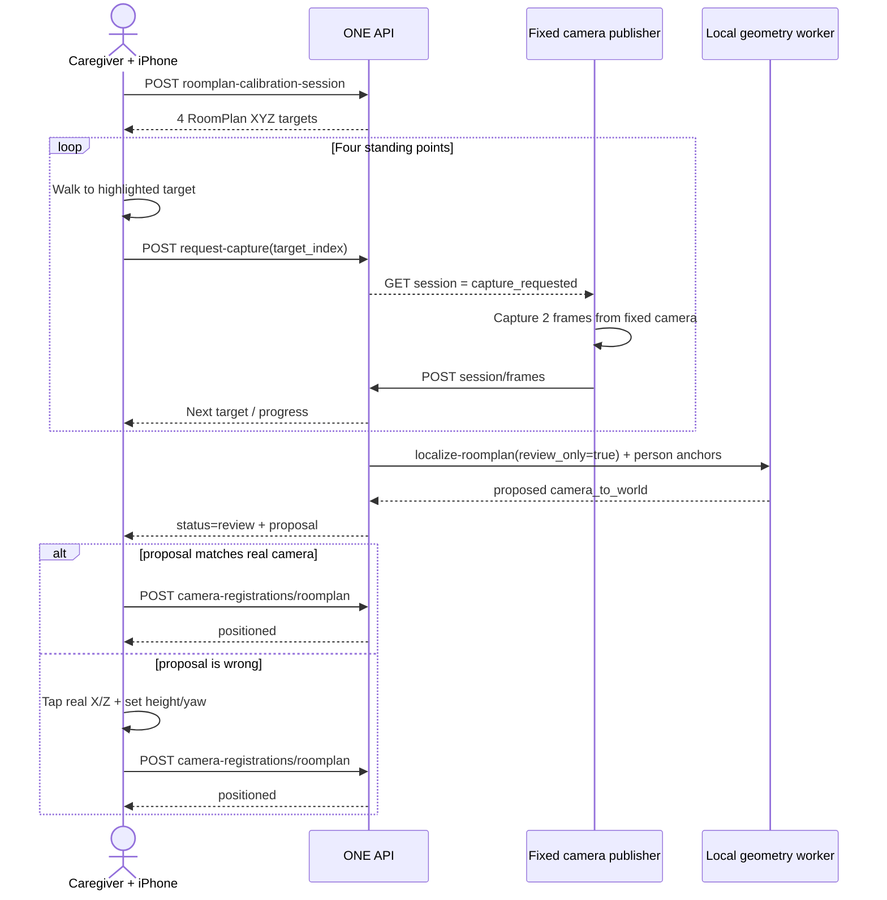
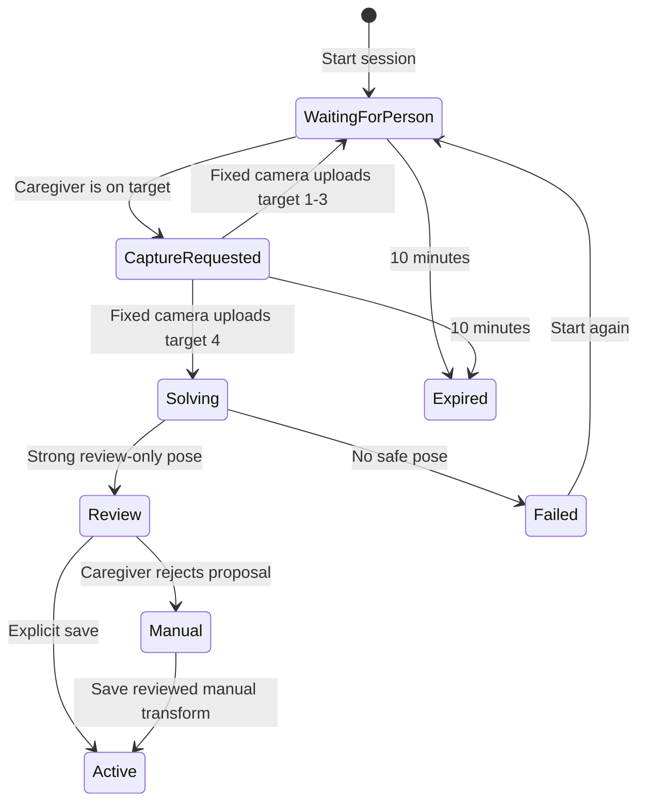
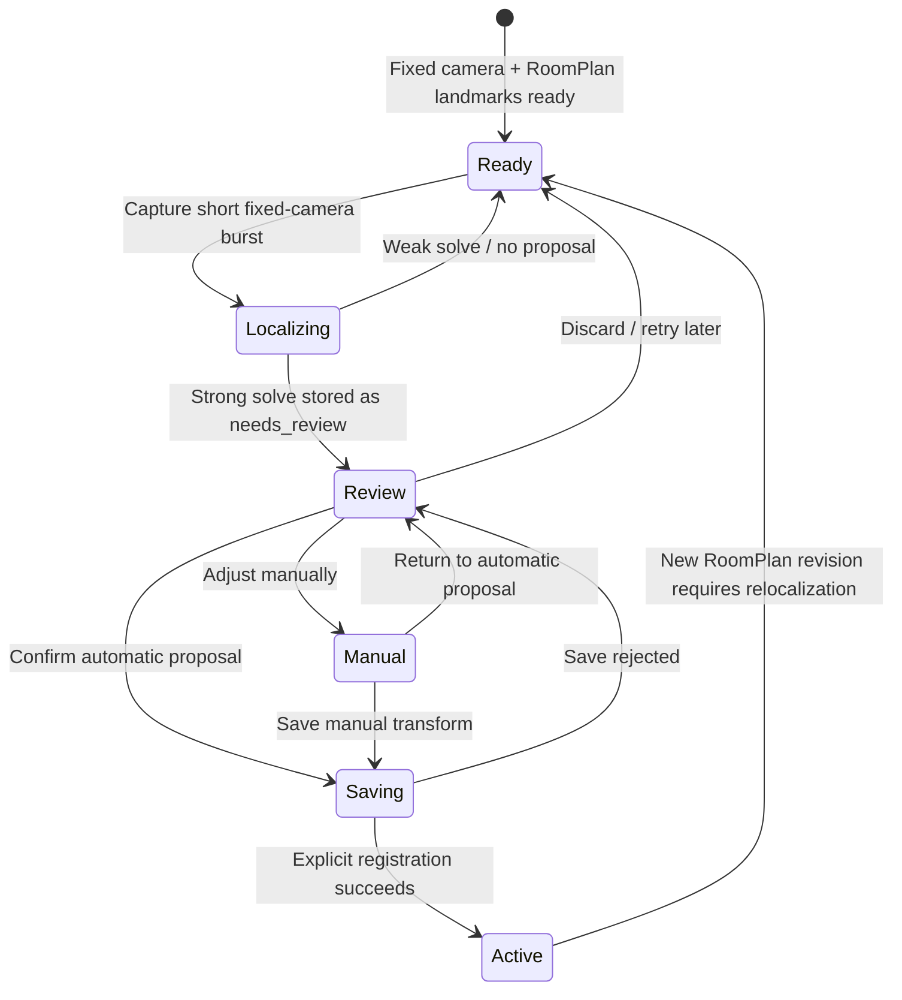
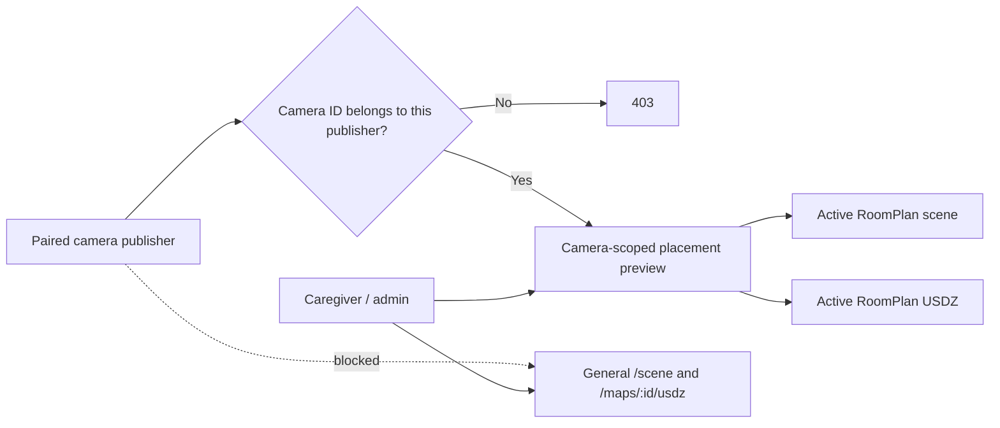

# Camera mapping

ONE treats map geometry as evidence with explicit provenance. A browser camera
can produce an approximate 2D room view, but it can never qualify as a 3D
RoomPlan model.

This page focuses on map provenance, job states, and route behavior. For a
contributor-level explanation of the algorithms and how mapping connects to
live detection, RoomPlan localization, scene selection, and frontend rendering,
see [Spatial models, maps & detection](/api/spatial-vision).

For a diagram-first walkthrough of the same system—from LiDAR capture through
fixed-camera PnP localization and live object projection—see the
[LiDAR & mapping visual guide](/architecture/lidar-mapping-visual-guide).

## Two map sources

| Source | Dimension | Producer | Stored geometry | Scale | Dashboard |
| --- | --- | --- | --- | --- | --- |
| camera-cv-2d | 2D | Paired browser camera, real YOLOv8-World v2 worker, and OpenCV structural estimator | Relative polygons, wall segments, detected furniture, doors/windows, camera pose, confidence, and model metadata | Relative by default; optional caregiver reference scale; metric_scale_known=false | Accessible 2D map |
| roomplan-lidar-3d | 3D | Native iPhone or iPad RoomPlan on supported LiDAR hardware | Validated RoomPlan walls, openings, floors, objects, coordinate frame, and artifact metadata | Metric coordinates supplied by RoomPlan, still approximate | 3D view |
| legacy-2d | 2D | Older provisional or manual-zone records | Zone labels or rectangles without camera-derived geometry | Unknown | 2D only, marked for rescan |

The target map and scene responses carry source and dimension together. The web
client must not infer a 3D capability from a camera connection, a rectangle,
or a successful calibration request. Until those fields are present in the
running API, the client must treat a missing source or dimension as legacy-2d.

## Optional room walkthrough

The camera device stays on the publisher setup page after pairing:

1. The caregiver creates a short-lived device code and keeps the pairing sheet
   open.
2. The camera device enters the code. The backend creates the camera record at
   this point, independently of any later mapping result.
3. The device records explicit video_capture consent and requests camera and
   microphone access from a secure origin. Preview, LiveKit publishing, and
   object vision do not wait for a map.
4. If room context is wanted, the user explicitly records a roughly 14-second,
   20-frame walkthrough. Natural motion is allowed; the guide asks for corners,
   floor-wall boundaries, doors, and large furniture.
5. The device submits bounded RGB samples for that camera. The caregiver page
   polls the generation resource and remains on the same setup sheet.
6. The local room-layout worker runs the configured real model on the walkthrough,
   derives relative polygons and walls from visible structure, and returns
   detected furniture, doors, windows, camera pose, confidence, and model
   version. Raw frame bytes are discarded after the job finishes.
7. A ready result becomes the current 2D map. A low-confidence or failed result
   leaves the camera saved and offers retry or continue-without-map actions.

The result is a spatial aid for reviewable observations, not a survey. RGB
alone does not provide a reliable world scale, so the 2D contract never
reports a fabricated error in meters.

## Map-generation job states

| Status | Meaning | Persistence behavior |
| --- | --- | --- |
| collecting | The paired camera has opened a bounded walkthrough job and is preparing its samples | No map is replaced; jobs older than 15 minutes expire so a fresh capture can start |
| processing | The local worker is analyzing the bounded sample set | No raw frame is written to the database or object store; an API restart marks the interrupted job failed and retryable |
| ready | Geometry passed the configured confidence threshold and a map revision was saved | Derived geometry and metadata are retained as a map revision |
| needs_rescan | Coverage, motion, visibility, or confidence was insufficient | The old map remains; the failed sample set is discarded |
| unavailable | The local GPU worker cannot be reached or cannot run the selected model | No new map is saved; the UI explains how to restore the worker |
| failed | The request or worker failed validation or processing | The error status may be retained for support; frame bytes are discarded |

Every job is scoped to a home and camera. A paired publisher can submit frames
only with its own camera credential. A caregiver can read the status for the
paired home but cannot use a different camera ID to attach samples.

## Public endpoint status

The current backend exposes these exact map routes:

| Route | Current behavior |
| --- | --- |
| GET /api/v1/homes/{home_id}/maps | Lists stored map records, newest revision first |
| GET /api/v1/homes/{home_id}/maps/current | Returns the newest eligible real-model map or 404 when none exists; historical fixture revisions are not active |
| GET /api/v1/homes/{home_id}/maps/{map_id} | Returns one map record or 404 |
| GET /api/v1/homes/{home_id}/scene | Returns scene ID, revision, source, dimension, geometry status, zones, polygons, walls, camera pose, confidence, and map ID |
| POST /api/v1/homes/{home_id}/maps/provisional | Compatibility route; stores caller-supplied zones as legacy-2d and marks them rescan-required |
| POST /api/v1/homes/{home_id}/maps/roomplan | Accepts only strict native RoomPlan/LiDAR metadata and valid 3D geometry; incomplete payloads return 422 |
| POST /api/v1/homes/{home_id}/calibrations | Compatibility record; RGB camera generation stores model metrics with accuracy_m=null |

Automatic camera generation uses these additional routes:

| Route | Behavior |
| --- | --- |
| POST /api/v1/homes/{home_id}/cameras/{camera_id}/map-generation | Starts or returns the active collecting job; requires active video consent |
| GET /api/v1/homes/{home_id}/cameras/{camera_id}/map-generation | Returns the newest job for that camera |
| POST /api/v1/homes/{home_id}/cameras/{camera_id}/map-generation/{job_id}/frames | Accepts 3–20 bounded RGB samples; only the paired publisher may submit them |
| GET /api/v1/homes/{home_id}/cameras/{camera_id}/map-generation/{job_id} | Returns progress, terminal state, metrics, model version, and map ID when ready |
| POST /api/v1/homes/{home_id}/maps/{map_id}/visual-landmarks | Builds and stores a derived ORB landmark index from bounded native RGB + LiDAR depth samples for the active RoomPlan revision |
| GET /api/v1/homes/{home_id}/cameras/{camera_id}/roomplan-readiness | Lets the paired camera check whether the active RoomPlan revision and landmark index are ready without exposing household scene controls |
| POST /api/v1/homes/{home_id}/cameras/{camera_id}/localize-roomplan | Matches fixed-camera JPEGs to the RoomPlan landmark index. Camera setup sends `review_only=true`, so a strong solve is stored as `needs_review` and returned as a proposal rather than becoming active |
| POST /api/v1/homes/{home_id}/cameras/{camera_id}/roomplan-calibration-session | Caregiver starts a 10-minute in-memory four-point calibration session for one fixed camera |
| GET /api/v1/homes/{home_id}/cameras/{camera_id}/roomplan-calibration-session | Caregiver or that camera's publisher reads target/progress/proposal state; raw frame bytes are never returned |
| POST /api/v1/homes/{home_id}/cameras/{camera_id}/roomplan-calibration-session/request-capture | Caregiver marks the current standing point ready so the fixed camera may capture it |
| POST /api/v1/homes/{home_id}/cameras/{camera_id}/roomplan-calibration-session/frames | Only that paired publisher may submit the requested one- or two-frame burst; frames stay process-memory-only and are cleared after solve/cancel/expiry |
| DELETE /api/v1/homes/{home_id}/cameras/{camera_id}/roomplan-calibration-session | Cancels the transient session and immediately drops any in-memory calibration frames |
| GET /api/v1/homes/{home_id}/cameras/{camera_id}/roomplan-placement-preview | Returns the active RoomPlan scene needed to review that camera's placement; a publisher may fetch only its own camera preview |
| GET /api/v1/homes/{home_id}/cameras/{camera_id}/roomplan-placement-preview/usdz | Returns the active RoomPlan USDZ through the same camera-scoped publisher-safe boundary |
| POST /api/v1/homes/{home_id}/camera-registrations/roomplan | Explicitly confirms an automatic proposal or a manually adjusted transform. Only this save replaces the active placement |
| POST /api/v1/homes/{home_id}/vision/frames | Runs bounded local YOLO-World detection and, for a registered camera, projects stable detections into the RoomPlan frame |

The frame endpoint accepts `frame_base64`, `width`, `height`, and optional
`captured_at`. Each frame is limited to 3 MB after decoding and the whole batch
to 18 MB. Frame bytes are held only during processing and are not written to the
database, object store, logs, or map response.

## Internal geometry-service contract

The room-layout worker is a local processing dependency, not a public API. The
backend calls the configured `ONE_GEOMETRY_SERVICE_URL` at
`POST /v1/room-layout`; its behavioral contract is:

- input is a bounded sequence of RGB frames for one authorized camera, with
  source dimensions, capture timestamps, orientation, and room label;
- processing is local to the M3 Pro host through PyTorch/MPS and the configured
  YOLOv8-World v2 checkpoint; no frame is sent to a cloud or paid vision
  provider;
- success returns normalized polygons, wall segments, detected furniture,
  door/window openings, a relative camera pose, confidence, model version,
  source resolution, and metric_scale_known=false;
- low coverage or low confidence returns needs_rescan and no new map;
- worker reachability or device failure returns unavailable and no new map;
- malformed input or an exception returns failed and frame bytes are discarded.

The checkout includes the host-side service in `one/geometry_service/`. Model
mode requires the real YOLOv8-World v2 checkpoint, its checked-in configuration,
Ultralytics/OpenCV dependencies, and a working PyTorch accelerator. If the
service is not ready, the API marks a generation job unavailable; it does not
silently switch to a rectangle, synthetic object list, or alternate fallback.
See [Real camera geometry model](/architecture/real-geometry-model) for the
installation and health contract.

## Derived 2D payload

A camera map contains the following reviewable fields:

- normalized polygon vertices and wall segments in a camera-relative frame;
- model-detected furniture items and door/window opening segments when visible;
- the relative camera pose and image-space transform used for the projection;
- a 0–1 overall confidence and per-geometry confidence where available;
- source resolution, capture interval, job ID, real room-layout model version,
  detection counts, and structural-estimation method;
- source camera-cv-2d, dimension 2d, and metric_scale_known=false.

The frontend renders this data as accessible SVG. It should not add missing
widths, heights, or positions with hardcoded rectangles. If geometry is absent,
the honest state is needs_rescan, not a convincing-looking empty floor plan.

## LiDAR-only 3D gate

The RoomPlan upload contract accepts a 3D map only when all of these facts are
present:

- the producer is the native iOS client;
- the payload identifies RoomPlan and a supported schema version;
- device capability metadata says LiDAR is available and was used;
- the geometry includes a valid coordinate frame, units, up axis, and 3D
  surfaces or objects;
- the payload passes structural validation before it becomes a map revision.

Missing provenance, missing LiDAR evidence, malformed geometry, or a browser
payload returns 422. A 2D camera map is never extruded into a 3D model. The
3D control is hidden until a validated roomplan-lidar-3d map is current.

Safari can request camera and microphone access, but it cannot run Apple
RoomPlan. RoomPlan capture and serialization must happen in the native
one-ios target on a physical supported device.

## LiDAR-to-camera registration

There are now two truthful registration paths into the native RoomPlan frame.
If the selected camera is the same physical iPhone performing the scan, the
native app can store the ARKit `camera_to_world` transform captured inside that
RoomPlan session. For a separate fixed browser/webcam, the native app also
collects a bounded set of RGB + LiDAR depth samples while scanning and uploads
them to build a derived visual landmark index. Raw scan RGB/depth bytes are not
retained by the backend or worker.

`POST /api/v1/homes/{home_id}/camera-registrations/roomplan` accepts only an
enabled camera and the active `roomplan-lidar-3d` / `roomplan-local` map. Normal
tracking stores an active `auto-roomplan-registration` calibration. Limited or
unavailable tracking is stored as `needs_rescan` and no world pose is exposed
to scene consumers. Creating a new map revision invalidates the old placement.

`POST /api/v1/homes/{home_id}/maps/{map_id}/visual-landmarks` accepts the
native RGB/depth samples for the active RoomPlan revision and stores only the
derived ORB landmark artifact. `POST /api/v1/homes/{home_id}/cameras/{camera_id}/localize-roomplan`
accepts one to eight fixed-camera JPEGs, matches their ORB features to those
metric landmarks, and runs PnP/RANSAC. Camera setup calls it with
`review_only=true`: a strong solution is stored as `needs_review` and returned
with `review_required=true`, including the 4×4 camera transform, inlier count,
match count, reprojection error, confidence, and intrinsics source. It does
**not** invalidate an already confirmed active placement. Weak or ambiguous
matching returns `needs_rescan` and exposes no proposal.

The publisher then loads the active RoomPlan scene and USDZ through the
camera-scoped placement-preview routes. The proposed camera is rendered in
amber. The user can confirm it, switch to manual placement and click a floor
position, tune yaw/tilt/height, or discard it and retry automatic matching. Only
`POST /camera-registrations/roomplan` activates the reviewed transform; that
explicit save is the boundary that supersedes the previous active or pending
placement.

### iPhone-guided four-point calibration

The native iPhone app can now coordinate the same person-anchor calibration
without turning the iPhone camera into the fixed camera. The API derives four
standing targets from the active RoomPlan floor polygon. Target selection treats
RoomPlan furniture/object volumes such as beds, tables, sofas, storage, and
other raised geometry as occupied floor area, expands those footprints with a
standing-clearance margin, and keeps targets away from room boundaries. If four
separated clear-floor points cannot be found, calibration is rejected instead
of asking the caregiver to stand on obstructed geometry. The caregiver walks to
each target with the iPhone; when they tap **I'm standing on point N**, the API
changes that target to `capture_requested`. The paired browser publisher polls
only its own session, captures two short frames from the fixed camera, and
submits those frames with the known RoomPlan XYZ point as the implicit person
anchor.

The native calibration guide renders wall borders and RoomPlan object
footprints in its top-down view. When the USDZ attachment is available it also
shows the same four targets directly on the interactive 3D RoomPlan model, so a
caregiver can match the highlighted point against furniture in the physical
room before moving there.

The session itself is deliberately non-durable. Its ID, target coordinates,
progress, and final proposal exist in API process memory for at most ten
minutes. JPEG bytes and the frame-to-target anchor list are cleared after the
fourth-point solve, cancellation, or expiry. The only durable artifact created
before confirmation is the existing `needs_review` localization row; activation
still requires the normal RoomPlan registration endpoint.

`GET /homes/{home_id}/cameras` also exposes per-camera
`calibration_needed`, `roomplan_registration_status`, and `roomplan_map_id`.
The state is evaluated against the current active RoomPlan revision, so a pose
from an older scan never removes the calibration-needed badge.

The browser's camera-derived 2D sweep remains independent approximate evidence;
it is never converted or relabeled as RoomPlan geometry. Metric 3D placement is
claimed only after one of the explicit RoomPlan registration paths succeeds.
When a camera has an active registration, local object detections can be
projected into `roomplan-local`, associated with a RoomPlan room zone, and
persisted as derived observations. Raw frame bytes remain transient.

### Publisher-scoped review boundary

The review UI needs map geometry but a paired camera publisher must not gain the
caregiver/admin scene permissions used by the dashboard. The API therefore
exposes only the active RoomPlan scene and USDZ needed for that publisher's own
camera placement.

This keeps the review experience available on the fixed camera device without
relaxing the household dashboard authorization boundary.

## Current checkout status

The native app can capture, normalize, and upload a strict RoomPlan scene,
attach its USDZ model, register the scanning iPhone directly, and build a
private visual landmark index for positioning separate fixed cameras. The scene
contract exposes one or more registrations separately as `cameraRegistration`
and `cameraRegistrations`. Existing camera-relative 2D maps remain separate and
cannot unlock metric 3D camera placement by themselves.
