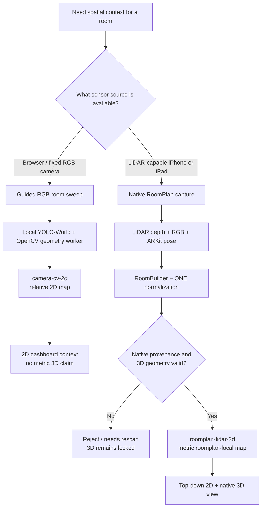
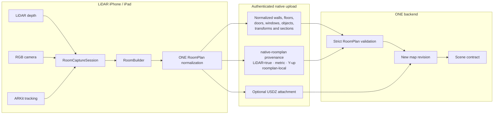
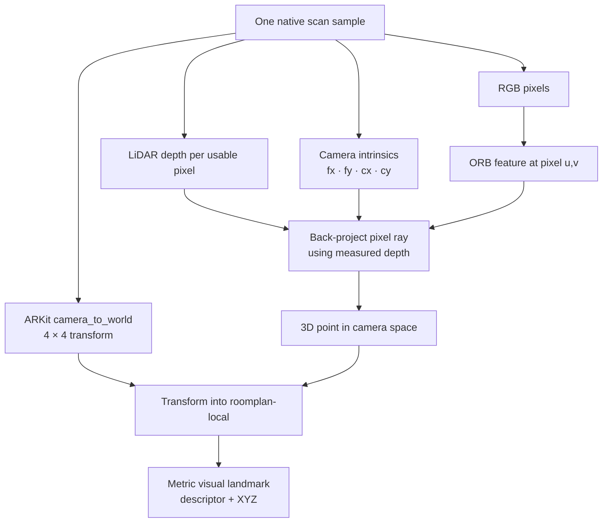
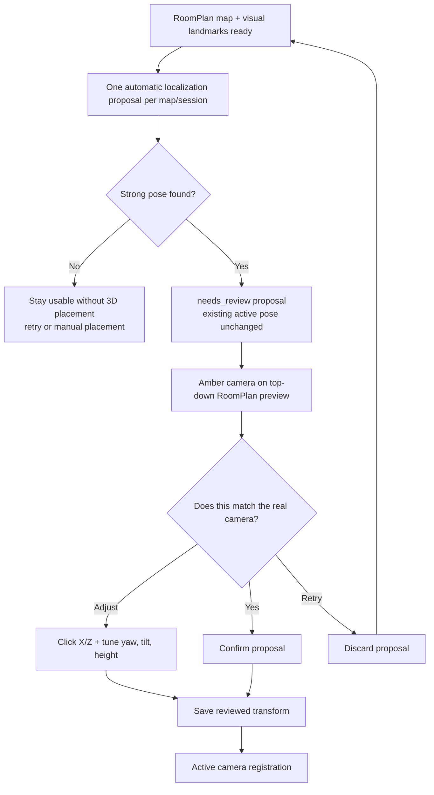
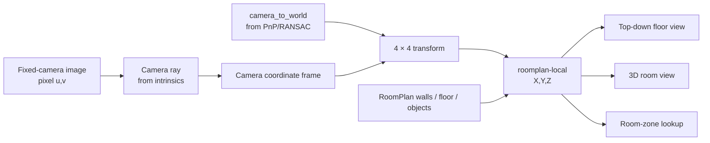
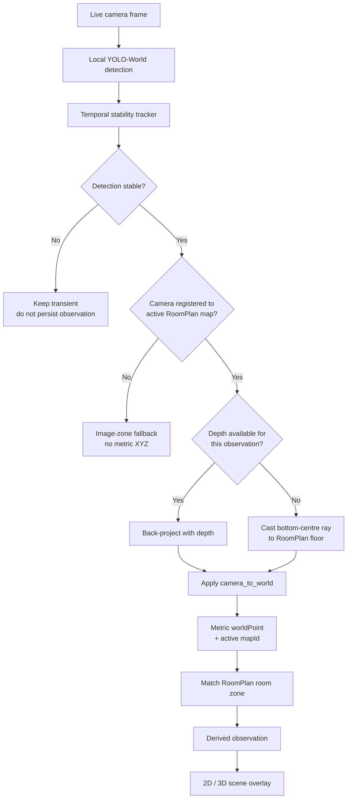
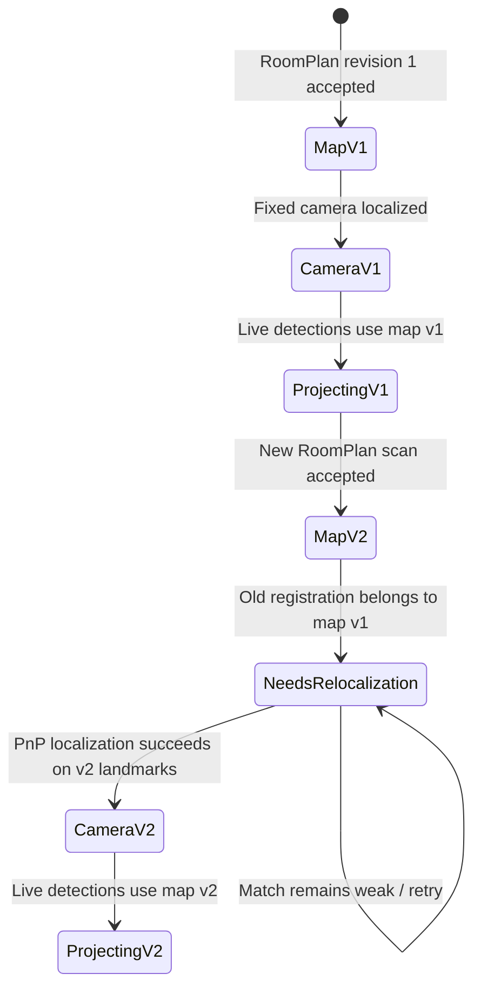
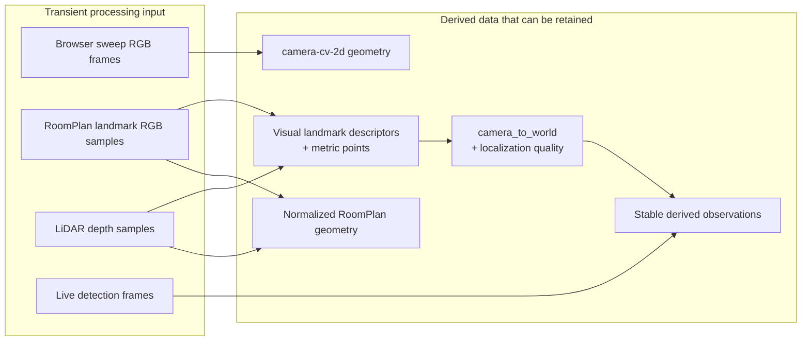

# LiDAR & mapping visual guide

This page is the visual companion to [Camera mapping](/architecture/camera-mapping)
and [Spatial models, maps & detection](/api/spatial-vision). It shows how ONE
turns a native RoomPlan scan into a metric room model, positions a separate
fixed camera inside that model, and projects live detections back into the same
coordinate frame.

The key idea is simple: **the map, the camera pose, and a detected object are
three separate pieces of evidence**. ONE only combines them when their
provenance and map revision agree.

## 1. Which spatial path is being used?

The browser and native LiDAR paths solve different problems. A browser sweep
can give useful relative 2D context, while a physical RoomPlan scan is the
source of the metric 3D room.



The browser path never gets promoted into RoomPlan. A convincing-looking 2D
polygon is still `camera-cv-2d`; only a validated native LiDAR payload can
create `roomplan-lidar-3d`.

## 2. How a LiDAR scan becomes the room model

RoomPlan is not just a mesh export. The native app keeps structured geometry
as the canonical source and can attach USDZ as a richer rendering artifact.



The structured RoomPlan payload remains authoritative. USDZ is attached to the
same validated map revision for richer 3D rendering; it is not used to invent
provenance or unlock 3D by itself.

## 3. What is actually measured during the scan?

The scan combines several sensor facts. LiDAR contributes depth, ARKit
contributes camera motion and pose, and RGB contributes visual features that
can later help a different camera recognize where it is.



Conceptually, the intrinsics turn a pixel into a camera ray, LiDAR supplies the
distance along that ray, and `camera_to_world` moves the resulting point into
the RoomPlan coordinate frame.

## 4. How a separate fixed camera is positioned in the LiDAR map

The Mac/browser camera did not participate in the RoomPlan ARKit session, so it
does not automatically know its world pose. ONE creates a visual bridge between
the scan and the fixed camera.

```mermaid
sequenceDiagram
    participant I as LiDAR iPhone
    participant A as ONE API
    participant G as Geometry worker
    participant C as Fixed camera
    participant S as Scene

    I->>A: Upload RoomPlan map revision
    I->>A: Upload bounded RGB + depth + ARKit samples
    A->>G: Build visual landmarks
    G-->>A: ORB descriptors + metric XYZ landmarks
    A-->>S: Store derived landmark artifact for map revision

    C->>A: Send current JPEG burst with review_only=true
    A->>G: Localize against active RoomPlan landmarks
    G->>G: ORB matching
    G->>G: 2D ↔ 3D correspondences
    G->>G: solvePnPRansac + quality checks

    alt Strong, unambiguous solution
        G-->>A: positioned + camera_to_world
        A-->>S: Store needs_review proposal
        A-->>C: review_required=true + proposed transform
    else Weak or ambiguous solution
        G-->>A: needs_rescan
        A-->>C: No proposal; retry or place manually
    end
```

PnP/RANSAC is the bridge: it finds the 6-DoF fixed-camera pose that best
explains where the matched 3D RoomPlan landmarks appear in the camera image.
Passing the localization gate creates a **proposal**, not an active placement.
The camera becomes active in the map only after a person reviews and saves that
transform.

## 5. Review before activation

Automatic localization is deliberately one step short of activation. The fixed
camera page loads the camera-scoped RoomPlan preview, draws the proposed camera
in amber, and gives the person three choices: confirm it, adjust it manually,
or discard it and retry.



```mermaid
sequenceDiagram
    participant C as Fixed camera page
    participant A as ONE API
    participant P as RoomPlan preview

    C->>A: POST localize-roomplan (review_only=true)
    A-->>C: needs_review proposal + camera_to_world
    C->>A: GET camera-scoped placement preview
    A-->>C: active RoomPlan scene
    C->>A: GET camera-scoped preview USDZ
    A-->>C: native RoomPlan model
    C->>P: Render amber proposed camera
    alt proposal is correct
        C->>A: POST camera-registrations/roomplan
        A-->>C: positioned
    else manual adjustment
        C->>P: Click floor position + adjust pose
        C->>A: POST camera-registrations/roomplan
        A-->>C: positioned
    else retry
        C->>C: Discard proposal; keep prior active placement
    end
```

The general household `/scene` and normal map USDZ routes remain
caregiver/admin surfaces. A publisher can fetch the placement preview only for
its own camera, so review does not broaden camera-device permissions.

## 6. The coordinate-frame bridge

Once localization succeeds, the fixed camera and RoomPlan geometry share one
frame. This is what makes a camera frustum, furniture, and live detections line
up in the same map.



Without a valid registration, ONE can still run local object detection, but it
cannot truthfully place the result at metric XYZ coordinates in the RoomPlan
scene.

## 7. From a live camera frame to a marker on the map

Detection and mapping are separate. A map can exist without live detections,
and YOLO can detect an object without knowing its RoomPlan position.



The frontend only draws a metric observation when its `mapId` matches the
active scene. That prevents an old point from appearing on a newly scanned
room revision.

## 8. Why a new LiDAR scan invalidates camera placement

A RoomPlan revision defines a coordinate frame. Even if the new scan describes
the same physical room, ONE cannot assume its origin and orientation are
identical to the previous revision.



This revision boundary is why the scene carries map IDs for geometry,
registrations, and observations. A stale registration is not silently reused.

## 9. What ONE keeps and what stays transient

The visual pipeline is designed so raw frames are working data, while the
useful spatial result is retained as derived geometry and registration state.



Raw browser walkthrough frames, RoomPlan landmark RGB/depth samples, and live
vision frames are bounded processing inputs. The persistent value is the
normalized room geometry, derived landmark index, camera registration, and
stable observations required for the product experience.

## End-to-end mental model

If you only remember one picture, use this one:

```mermaid
flowchart LR
    scan["1 · Scan room<br/>LiDAR + RGB + ARKit"] --> map["2 · Build metric map<br/>roomplan-lidar-3d"]
    map --> localize["3 · Propose fixed-camera pose<br/>ORB + PnP/RANSAC"]
    localize --> review["4 · Review placement<br/>confirm or adjust manually"]
    review --> activate["5 · Activate reviewed transform"]
    activate --> detect["6 · Detect locally<br/>YOLO + stability"]
    detect --> project["7 · Project into map<br/>camera_to_world"]
    project --> understand["8 · Render context<br/>room + camera + observations"]
```



For exact route names, validation rules, failure states, and payload fields,
continue with [Camera mapping](/architecture/camera-mapping),
[Spatial models, maps & detection](/api/spatial-vision), and
[Homes, rooms & calibration](/api/homes).
