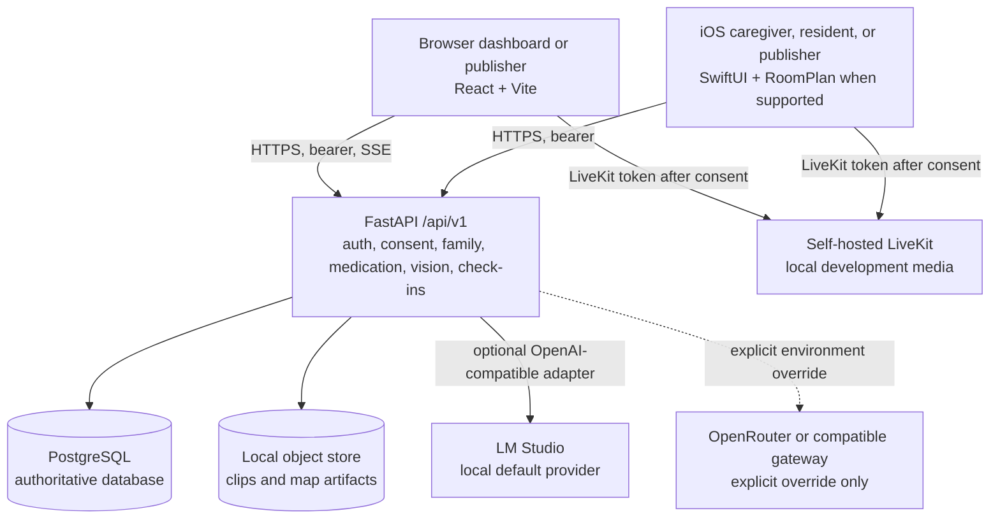
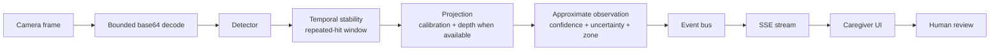

# Architecture overview

ONE is a local-first, modular-monolith MVP. The backend is the policy and evidence boundary; clients are role-specific presentation and capture surfaces. Family mode adds bounded household coordination: multiple member accounts can have caregiver roles, while plans/check-ins remain purpose-gated and explicitly non-medical.

The system boundary is summarized below: clients capture or review information, while the local API enforces policy and coordinates storage, media, and optional inference.

The diagram intentionally shows PostgreSQL and the object store behind FastAPI, and LiveKit as a separately authorized media path; neither client bypasses the API policy boundary.

## Map provenance boundary

The camera sweep and native RoomPlan scan are different evidence paths. The
local M3 Pro geometry worker runs the real YOLOv8-World v2 detector plus
image-space structural estimation over temporary RGB samples and returns only
relative 2D geometry. A native iPhone or iPad RoomPlan scan is the only source
that can qualify for 3D, and only after provenance, LiDAR capability, coordinate
frame, units, and geometry validation. The API must keep a missing or failed
worker result from replacing the previous map.

The backend checkout includes the host-side room-layout service seam, the
persistent camera map-generation job, and a strict 3D gate. The native iOS
RoomPlan producer still needs to serialize and upload its captured result; until
that work lands, only camera-derived relative 2D maps can be created. The map
boundary is documented in [Camera mapping](/architecture/camera-mapping).

## Request boundaries

- Every product route is under `/api/v1`.
- Pairing creates a home, user, membership, runtime state, and one-time code; completion creates a hashed-token session.
- Protected handlers verify the bearer token, session expiry, membership, and home ownership.
- Video capture endpoints additionally require active `video_capture` consent and reject the paused state.
- Vision frames are decoded and processed in memory; the current response explicitly says `persisted: false`.
- Observations become approximate events with evidence IDs and expiry. Clips are separately bounded and encrypted when a key is configured.

## Data flow

The vision path below turns a camera frame into an approximate, reviewable event; it does not make a diagnosis or persist the raw frame in the current response path.

When calibration or depth is unavailable, projection produces a wider zone fallback rather than a fabricated coordinate. The optional LLM adapter receives bounded collected context downstream of this path.

The LLM adapter is downstream of collected context. It returns a structured
summary when the configured OpenAI-compatible provider responds and a
deterministic non-medical fallback when it does not. LM Studio is the default;
hosted providers require an explicit environment override and privacy review.
The adapter is never the authorization or safety boundary.

## Family-mode boundary

Family mode is not a continuous household camera feed. With `family_mode` consent, an admin or caregiver can list household members and issue a single-use invite for another resident or caregiver. With `medication_management` consent, caregivers can organize human-entered plans, deterministic reminder slots, and check-in states (`pending`, `taken`, `skipped`, `missed`). The family assistant receives only the selected subject’s active plans and bounded check-in rows; it does not receive camera frames, transcripts, events, or the full household stream.

The web/iOS family surfaces currently demonstrate this flow with synthetic rows. The backend routes persist through the selected database, but client fixture data and real-person governance are not implied.
