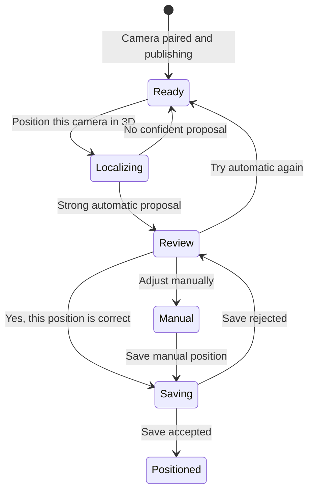

# Add a phone as a camera

ONE uses two roles during camera setup:

- The **caregiver web dashboard or native iOS app** creates and monitors the
  device pairing against the same authenticated backend state.
- The **camera device** opens ONE in Safari, accepts the one-time code, grants
  consent, previews the rear camera, and optionally records a room walkthrough.

Pairing and room mapping are separate. ONE saves the camera to the household as
soon as the one-time code is accepted. Reloading the camera page, skipping the
walkthrough, or receiving a low-confidence mapping result does not remove it.

The native iOS app is a caregiver/resident client, can create and monitor a
publisher pairing code from **Home → Cameras**, and produces LiDAR RoomPlan
scans. It does **not** yet run as a continuous camera publisher. To use an
iPhone as the fixed camera today, use the browser publisher flow below. Do not
enter a camera pairing code into the native app's household sign-in form;
publisher pairing and person sign-in are different credentials.

## Before you begin

1. Start the ONE API, frontend, and LiveKit services.
2. Open the frontend through an HTTPS address reachable by both devices. The
   private Tailscale URL is the recommended physical-phone setup.
3. Sign in as the household caregiver or admin and make sure **Room and camera
   data** (`video_capture`) is allowed and care is not paused.
4. Keep the fixed camera device powered and connected to the same private
   network. The fixed camera and the LiDAR scanner may be different devices.

`localhost` on an iPhone refers to the iPhone, not the Mac running ONE. Camera
permissions also require a secure origin on a physical phone, so use the
reported Tailscale HTTPS URL rather than a Mac-only loopback URL.

## Pair the camera

On the caregiver device, use either setup surface:

1. In the web dashboard, select **Pair a camera** in the Camera connection
   section; or in the native iOS app open **Home → Cameras → Pair camera**.
2. Give the device a recognizable name and generate the six-digit code.
3. Keep the pairing sheet open. The code expires after ten minutes and can be
   used only once. Both clients poll the real pairing-status endpoint rather
   than inferring connection from general backend health.

On the iPhone that will become the camera:

1. Open the same ONE HTTPS address in Safari and add `/join`, for example
   `https://one.example.ts.net/join`.
2. Enter the six-digit camera pairing code and select **Connect this camera**.
3. Read and accept the camera consent choice. Safari asks for system camera and
   microphone permission only after this step.
4. Select **Start consented preview** and confirm that the rear-camera view is
   live. Live publishing and local object vision can work without a room map.
5. When convenient, select **Record room walkthrough** and walk naturally for
   about 14 seconds. Include corners, floor-wall boundaries, doors, and large
   furniture. Normal hand movement is expected.
6. If mapping is not useful right now, select **Use camera without map**. A
   failed or low-confidence draft can be retried later without pairing again.
7. When a room draft is ready, put the phone in its fixed position and select
   **Camera is in its fixed spot**. Keep this page open while it publishes.

Back on the caregiver device:

1. Wait for the pairing state to change from **Waiting** to **Camera connected
   and saved**. The native iOS Cameras section also refreshes its real enabled
   camera list and shows the backend-reported online/paused state.
2. On the web dashboard, optionally refine the camera name and placement, then
   select **Save camera setup**.
3. Open the live view. A connected pairing confirms the device credential; a
   visible feed confirms that LiveKit publishing is also working.

## Add the LiDAR room scan

Use a LiDAR-capable iPhone or iPad signed into the household in the native ONE
app. The recommended Mac-camera setup is to keep the Mac fixed and publishing
while the iPhone is used only as the RoomPlan scanner.

1. Open **Map** in the native ONE app.
2. Select **Update room scan** and leave **Map only** selected when the iPhone
   is only the LiDAR scanner. ONE never auto-selects the household's only
   camera for direct registration.
3. Select **Start LiDAR scan**.
4. Walk slowly around the room so RoomPlan captures the walls, floor,
   openings, and visible furniture.
5. Tap **Done scanning** when the room is covered. ONE saves the metric scene,
   3D asset, and private visual landmarks used to locate a separate fixed
   camera later.
6. On the fixed Mac camera page, keep the camera still and select **Position
   this camera in 3D**. ONE captures a short burst from that fixed view and
   matches it against the RoomPlan landmark index to estimate the Mac camera's
   3D pose.
7. If automatic localization finds a strong pose, ONE shows it as an **amber
   preview** on the top-down RoomPlan map. This is only a proposal; it does not
   replace the active camera position yet.
8. Select **Yes, this position is correct** to confirm it, or choose **Adjust
   manually** and click the real camera position on the map. Manual placement
   also lets you tune viewing direction, downward tilt, and height above the
   floor before saving.
9. If the proposal is wrong, select **Try automatic again** or keep the camera
   usable without a 3D placement. A failed automatic solve never traps setup in
   a calibration loop.
10. After the explicit save succeeds, the camera reports **Positioned in the
    RoomPlan 3D map** and the reviewed transform becomes active.

The LiDAR scan may be completed before or after camera pairing. It belongs to
the household, not to the camera credential.

## Camera position and the LiDAR model

There are two truthful camera-registration paths. For a separate Mac/browser
camera, the native app uploads the RoomPlan map plus visual landmarks, then the
fixed browser camera supplies its own frames to the RoomPlan localization
endpoint. Feature matching plus PnP/RANSAC estimates that camera's pose in the
metric RoomPlan coordinate frame. Automatic localization is review-only during
setup: a strong solve becomes a pending proposal, and an existing confirmed
pose remains active until the user explicitly saves the reviewed or manually
adjusted transform.

If the scanning iPhone is itself the exact paired camera that will remain
fixed, you may explicitly select that camera instead of **Map only**. In that
same-device case, ONE records the final AR camera transform from the RoomPlan
session and registers it directly in `roomplan-local`. Do not select a Mac or
other separate browser camera here, because the iPhone's final AR pose is not
that camera's pose.

The optional Safari walkthrough remains camera-relative 2D evidence and is
never relabeled as RoomPlan/world geometry. It is not required for the
Mac-camera + iPhone-LiDAR flow.

## What the room walkthrough creates

The Safari walkthrough creates an approximate, camera-relative **2D** map and
does not claim measured scale. The native RoomPlan scan creates the metric
**3D** map. A separate fixed camera is localized from its own still frames;
only an explicitly selected same-device iPhone uses the scan's final
camera-to-world transform directly. These pose sources remain separate in the
API.

## If it does not connect

- **Invalid or expired code:** create a fresh code from **Pair a camera**.
- **Camera permission denied:** in iPhone Settings, allow Camera and Microphone
  for Safari, reload `/join`, and try again.
- **Blank preview or no live view:** verify that the phone is on the same
  Tailnet/private network, the page is HTTPS, LiveKit is reachable, and care is
  not paused.
- **Connected but no video:** pairing succeeded, but media publishing did not.
  Leave the publisher page open and check the LiveKit endpoint separately.
- **Map needs another pass:** the camera is still paired and usable. Retry the
  walkthrough later with steady lighting and clearer views of room boundaries.

See [Browser camera pairing](/architecture/browser-camera), [Docker
setup](/guide/docker), and [Troubleshooting](/guide/troubleshooting) for the
protocol and deployment details.
