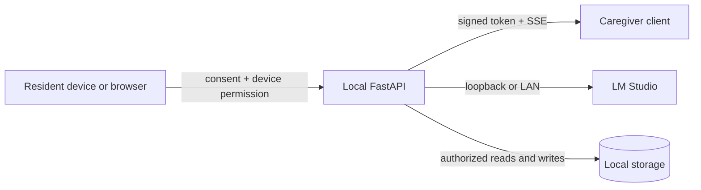

# Security model

## Trust boundaries

The trust boundaries are directional: capture requires client permission and consent, while the API remains the authority for sessions, home membership, and retrieval.

This boundary keeps provider and storage access behind the local API; hosted inference is an explicit configuration override and is subject to privacy review.

The API is authoritative for membership, home ownership, consent, expiry, subject access, and retrieval authorization. Client UI state is not a security boundary. A caregiver role does not automatically imply legal representation: represented-subject consent and family-purpose checks remain explicit.

## Current defenses

- Pairing codes, session tokens, and stored secrets are hashed where applicable.
- Session expiry and membership checks run on every protected route.
- Home IDs are checked against the authenticated member.
- Request models bound text, list sizes, frame dimensions, decoded frame size, and clip object keys.
- Clip object keys reject parent traversal.
- LiveKit webhook JWTs are checked for signature, issuer, expiry, and optional body digest.
- CORS origins are configured rather than wildcarded by default.
- Family/medication routes enforce caregiver/admin role and same-home subject checks, purpose consent, and synthetic-demo labeling.

## Deployment requirements before real use

Replace all compose example secrets, pin image versions, use TLS with trusted device certificates, keep LM Studio private, add rate limits and structured redacted logging, complete PostgreSQL/Redis/S3 adapters and migrations, verify LiveKit subscriber authorization, and review the threat model with the actual LAN/Tailscale topology. These are not silently implied by a successful local build.
